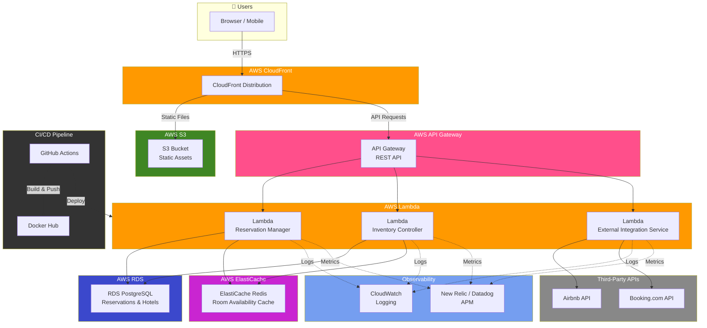

# Infrastructure Architecture Diagram

```mermaid
graph TB
    subgraph Users["👤 Users"]
        Browser["Browser / Mobile"]
    end

    subgraph CDN["AWS CloudFront"]
        CF["CloudFront Distribution"]
    end

    subgraph Static["AWS S3"]
        S3["S3 Bucket<br/>Static Assets"]
    end

    subgraph API["AWS API Gateway"]
        APIGW["API Gateway<br/>REST API"]
    end

    subgraph Compute["AWS Lambda"]
        L1["Lambda<br/>Reservation Manager"]
        L2["Lambda<br/>Inventory Controller"]
        L3["Lambda<br/>External Integration Service"]
    end

    subgraph Cache["AWS ElastiCache"]
        Redis["ElastiCache Redis<br/>Room Availability Cache"]
    end

    subgraph Database["AWS RDS"]
        RDS["RDS PostgreSQL<br/>Reservations & Hotels"]
    end

    subgraph Monitoring["Observability"]
        CW["CloudWatch<br/>Logging"]
        APM["New Relic / Datadog<br/>APM"]
    end

    subgraph External["Third-Party APIs"]
        Airbnb["Airbnb API"]
        Booking["Booking.com API"]
    end

    subgraph CICD["CI/CD Pipeline"]
        GH["GitHub Actions"]
        Docker["Docker Hub"]
    end

    Browser -->|"HTTPS"| CF
    CF -->|"Static Files"| S3
    CF -->|"API Requests"| APIGW
    APIGW --> L1
    APIGW --> L2
    APIGW --> L3
    L1 --> RDS
    L1 --> Redis
    L2 --> RDS
    L2 --> Redis
    L3 --> Airbnb
    L3 --> Booking
    L1 -.->|"Logs"| CW
    L2 -.->|"Logs"| CW
    L3 -.->|"Logs"| CW
    L1 -.->|"Metrics"| APM
    L2 -.->|"Metrics"| APM
    L3 -.->|"Metrics"| APM
    GH -->|"Build & Push"| Docker
    GH -->|"Deploy"| Compute

    style CDN fill:#ff9900,color:#fff
    style Static fill:#3f8624,color:#fff
    style API fill:#ff4f8b,color:#fff
    style Compute fill:#ff9900,color:#fff
    style Cache fill:#c925d1,color:#fff
    style Database fill:#3b48cc,color:#fff
    style Monitoring fill:#759ef0,color:#fff
    style External fill:#888,color:#fff
    style CICD fill:#333,color:#fff
```
