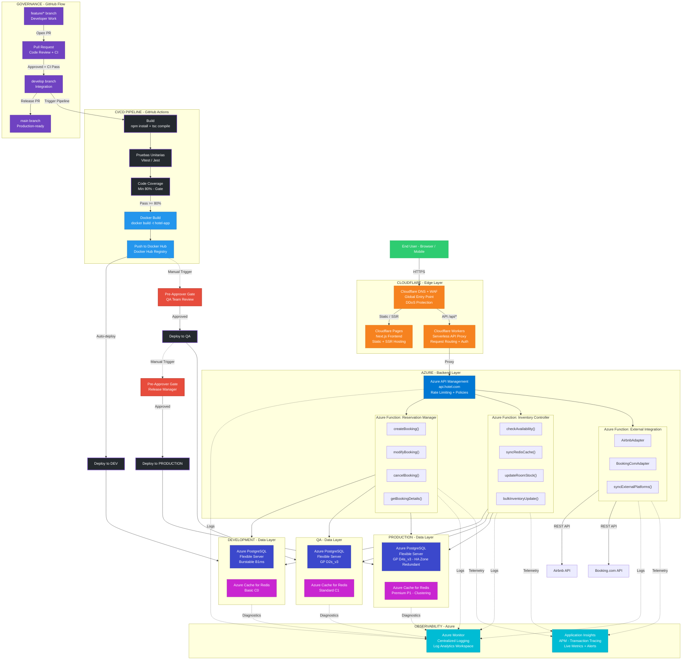

# Deployment & Infrastructure Diagram — Hotel Reservation System (Azure + Cloudflare)

## Architecture Overview

- Cloudflare Edge Layer (DNS + WAF, Pages, Workers)
- Azure Backend Layer (API Management, Azure Functions with methods)
- Multi-Environment Data Layer (Dev / QA / Prod with specific Azure tiers)
- CI/CD Pipeline — GitHub Actions (Build, Pruebas Unitarias, Coverage, Docker Hub)
- Deployment Flow with Pre-Approver Gates
- Governance — GitHub Flow branching strategy
- Observability — Azure Monitor + Application Insights

