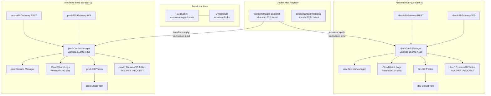
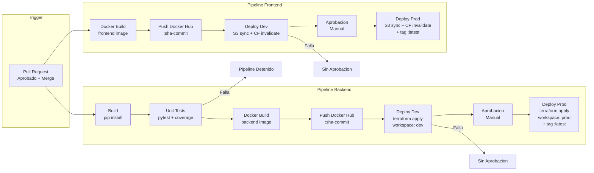
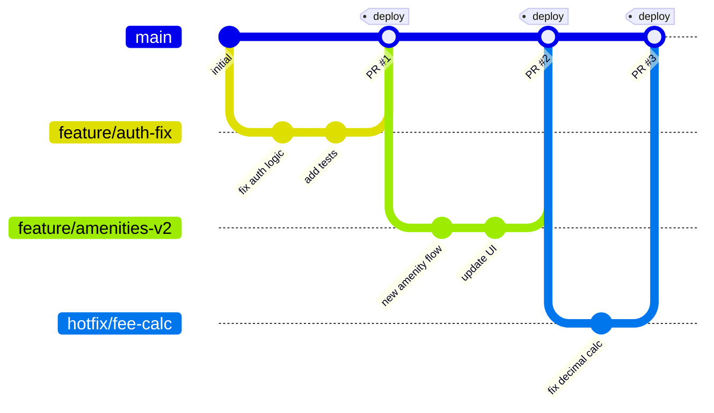
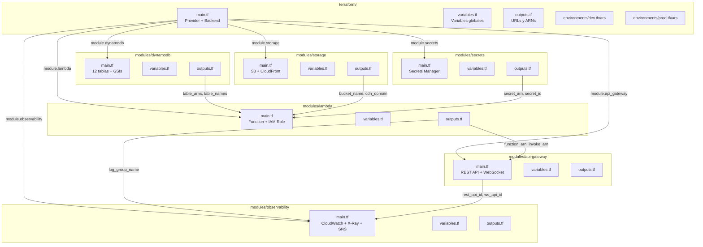

# Diseño Técnico — Infraestructura AWS con Terraform, Docker y CI/CD

## Visión General

Este documento describe el diseño técnico para migrar CondoManager Pro desde AWS SAM hacia una infraestructura gestionada con Terraform, contenedorizada con Docker, y automatizada con GitHub Actions. El sistema soporta dos ambientes (Dev y Prod) con puertas de aprobación manual, publica imágenes en Docker Hub, e incluye observabilidad completa con CloudWatch y X-Ray.

### Arquitectura de Alto Nivel

```mermaid
graph TB
    subgraph "Desarrolladores"
        DEV[Desarrollador]
    end

    subgraph "GitHub"
        REPO[Repositorio GitHub]
        GHA_BE[Pipeline Backend]
        GHA_FE[Pipeline Frontend]
    end

    subgraph "Docker Hub"
        DH_BE[Imagen Backend<br/>condomanager-backend]
        DH_FE[Imagen Frontend<br/>condomanager-frontend]
    end

    subgraph "AWS - Capa de Red y Entrada"
        CF[CloudFront<br/>CDN Fotos]
        APIGW_REST[API Gateway REST<br/>/{proxy+}]
        APIGW_WS[API Gateway WebSocket<br/>$connect / $disconnect]
    end

    subgraph "AWS - Cómputo"
        LAMBDA[Lambda Function<br/>Python 3.10 - Docker Image<br/>512MB / 30s]
    end

    subgraph "AWS - Almacenamiento"
        S3_PHOTOS[S3 Bucket<br/>Fotos de Condominios]
        SM[Secrets Manager<br/>JWT_Secret + Redis]
    end

    subgraph "AWS - Base de Datos"
        DDB_USERS[Users]
        DDB_CONDOS[Condos]
        DDB_UNITS[Units]
        DDB_RESIDENTS[Residents]
        DDB_FEES[Fees]
        DDB_INCIDENTS[Incidents]
        DDB_MAINT[MaintenanceTasks]
        DDB_ANN[Announcements]
        DDB_AMENITIES[Amenities]
        DDB_AMENITY_RES[AmenityReservations]
        DDB_TOKENS[AdminTokens]
        DDB_CONNS[Connections]
    end

    subgraph "AWS - Observabilidad"
        CW_LOGS[CloudWatch Logs]
        CW_DASH[CloudWatch Dashboard]
        CW_ALARMS[CloudWatch Alarms]
        XRAY[X-Ray Tracing]
        SNS[SNS Notificaciones]
    end

    subgraph "Externo"
        REDIS[Redis / Upstash<br/>Cache]
    end

    DEV -->|PR + Merge| REPO
    REPO --> GHA_BE
    REPO --> GHA_FE
    GHA_BE -->|docker push| DH_BE
    GHA_FE -->|docker push| DH_FE
    DH_BE -->|terraform apply| LAMBDA
    APIGW_REST -->|proxy| LAMBDA
    APIGW_WS -->|$connect/$disconnect| LAMBDA
    LAMBDA --> DDB_USERS
    LAMBDA --> DDB_CONDOS
    LAMBDA --> DDB_UNITS
    LAMBDA --> DDB_RESIDENTS
    LAMBDA --> DDB_FEES
    LAMBDA --> DDB_INCIDENTS
    LAMBDA --> DDB_MAINT
    LAMBDA --> DDB_ANN
    LAMBDA --> DDB_AMENITIES
    LAMBDA --> DDB_AMENITY_RES
    LAMBDA --> DDB_TOKENS
    LAMBDA --> DDB_CONNS
    LAMBDA --> S3_PHOTOS
    LAMBDA --> SM
    LAMBDA --> REDIS
    S3_PHOTOS --> CF
    LAMBDA --> CW_LOGS
    LAMBDA --> XRAY
    CW_LOGS --> CW_DASH
    CW_ALARMS --> SNS
```

## Arquitectura

### Decisiones de Diseño

1. **Lambda con imagen Docker**: En lugar de desplegar código ZIP, la Lambda usa una imagen Docker desde Docker Hub. Esto permite dependencias nativas (bcrypt) sin capas Lambda y garantiza paridad entre ambientes.

2. **Terraform con workspaces**: Se usan workspaces de Terraform (`dev` y `prod`) con archivos `.tfvars` por ambiente para parametrizar configuraciones (memoria, timeout, retención de logs).

3. **Estado remoto en S3 + DynamoDB**: El estado de Terraform se almacena en S3 con versionado y bloqueo mediante DynamoDB para evitar conflictos en despliegues concurrentes.

4. **Frontend como archivos estáticos en S3**: Dado que el frontend es vanilla HTML/CSS/JS sin paso de build, se despliega directamente a S3 + CloudFront en lugar de usar la imagen Docker de Nginx en producción. La imagen Docker de Nginx se usa para desarrollo local.

5. **GitHub Environments para aprobación**: Se usan GitHub Environments con reglas de protección para implementar las puertas de aprobación manual antes de producción.

### Diagrama de Despliegue Multi-Ambiente




## Componentes e Interfaces

### Diagrama del Pipeline CI/CD



### Diagrama de Estrategia de Ramas



**Flujo de ramas:**
- `main`: Rama protegida. Solo recibe merges de PRs aprobados. Cada merge dispara los pipelines.
- `feature/*`: Ramas de desarrollo. Al crear PR, se ejecutan tests como check requerido.
- `hotfix/*`: Correcciones urgentes. Mismo flujo de PR pero con prioridad.
- Regla: Mínimo 1 aprobación requerida antes del merge.

### Estructura de Módulos Terraform



### Estructura de Archivos del Proyecto

```
condomanager-pro/
├── .github/
│   └── workflows/
│       ├── backend-ci-cd.yml        # Pipeline CI/CD del backend
│       └── frontend-ci-cd.yml       # Pipeline CI/CD del frontend
├── backend/
│   ├── lambda_function.py           # Handler principal
│   ├── requirements.txt             # Dependencias Python
│   ├── Dockerfile                   # Imagen Docker del backend
│   └── tests/
│       ├── conftest.py              # Fixtures de pytest
│       ├── test_auth.py             # Tests de autenticación
│       ├── test_condos.py           # Tests de condominios
│       ├── test_units.py            # Tests de unidades
│       └── test_fees.py             # Tests de cuotas
├── frontend/
│   ├── index.html
│   ├── dashboard.html
│   ├── register.html
│   ├── script.js
│   ├── dashboard.js
│   ├── register.js
│   ├── styles.css
│   ├── config.js
│   ├── Dockerfile                   # Imagen Docker del frontend (Nginx)
│   └── nginx.conf                   # Configuración Nginx
├── terraform/
│   ├── main.tf                      # Root module - provider y backend
│   ├── variables.tf                 # Variables globales
│   ├── outputs.tf                   # Outputs del stack
│   ├── environments/
│   │   ├── dev.tfvars               # Variables para Dev
│   │   └── prod.tfvars              # Variables para Prod
│   └── modules/
│       ├── dynamodb/
│       │   ├── main.tf              # 12 tablas DynamoDB + GSIs
│       │   ├── variables.tf
│       │   └── outputs.tf
│       ├── lambda/
│       │   ├── main.tf              # Lambda function + IAM
│       │   ├── variables.tf
│       │   └── outputs.tf
│       ├── api-gateway/
│       │   ├── main.tf              # REST API + WebSocket API
│       │   ├── variables.tf
│       │   └── outputs.tf
│       ├── storage/
│       │   ├── main.tf              # S3 + CloudFront
│       │   ├── variables.tf
│       │   └── outputs.tf
│       ├── observability/
│       │   ├── main.tf              # CloudWatch + X-Ray + SNS
│       │   ├── variables.tf
│       │   └── outputs.tf
│       └── secrets/
│           ├── main.tf              # Secrets Manager
│           ├── variables.tf
│           └── outputs.tf
├── template.yaml                    # (Legacy) SAM template - referencia
└── samconfig.toml                   # (Legacy) SAM config - referencia
```


### Especificación del Dockerfile Backend

```dockerfile
# Imagen base compatible con AWS Lambda
FROM public.ecr.aws/lambda/python:3.10

# Copiar dependencias e instalar
COPY requirements.txt ${LAMBDA_TASK_ROOT}/
RUN pip install --no-cache-dir -r ${LAMBDA_TASK_ROOT}/requirements.txt

# Copiar código fuente
COPY lambda_function.py ${LAMBDA_TASK_ROOT}/

# Handler de Lambda
CMD ["lambda_function.lambda_handler"]
```

**Decisiones:**
- Se usa `public.ecr.aws/lambda/python:3.10` como base para compatibilidad nativa con Lambda container runtime.
- `--no-cache-dir` reduce el tamaño de la imagen.
- El handler apunta a `lambda_function.lambda_handler` tal como está definido en el código actual.

### Especificación del Dockerfile Frontend

```dockerfile
FROM nginx:alpine

# Copiar archivos estáticos
COPY index.html /usr/share/nginx/html/
COPY dashboard.html /usr/share/nginx/html/
COPY register.html /usr/share/nginx/html/
COPY script.js /usr/share/nginx/html/
COPY dashboard.js /usr/share/nginx/html/
COPY register.js /usr/share/nginx/html/
COPY styles.css /usr/share/nginx/html/
COPY config.js /usr/share/nginx/html/
COPY nginx.conf /etc/nginx/conf.d/default.conf

# Script de inyección de variables de entorno
COPY docker-entrypoint.sh /docker-entrypoint.sh
RUN chmod +x /docker-entrypoint.sh

EXPOSE 80

ENTRYPOINT ["/docker-entrypoint.sh"]
CMD ["nginx", "-g", "daemon off;"]
```

**Decisiones:**
- `nginx:alpine` minimiza el tamaño (~40MB).
- `docker-entrypoint.sh` reemplaza `AWS_API_URL` en `config.js` en tiempo de ejecución usando `envsubst` o `sed`, permitiendo inyectar la URL del API según el ambiente.
- En producción, los archivos se despliegan directamente a S3 + CloudFront (sin Nginx). La imagen Docker sirve para desarrollo local y como artefacto versionado.

### Especificación del Pipeline Backend (GitHub Actions)

```yaml
# .github/workflows/backend-ci-cd.yml
name: Backend CI/CD

on:
  push:
    branches: [main]
    paths: ['backend/**', 'terraform/**']
  pull_request:
    branches: [main]
    paths: ['backend/**']

jobs:
  build-and-test:
    runs-on: ubuntu-latest
    steps:
      - uses: actions/checkout@v4
      - uses: actions/setup-python@v5
        with: { python-version: '3.10' }
      - run: pip install -r backend/requirements.txt
      - run: pip install pytest pytest-cov
      - run: pytest backend/tests/ --junitxml=report.xml --cov=backend/ --cov-report=xml
      - uses: actions/upload-artifact@v4
        with: { name: test-results, path: report.xml }

  docker-build-push:
    needs: build-and-test
    if: github.event_name == 'push'
    runs-on: ubuntu-latest
    steps:
      - uses: actions/checkout@v4
      - uses: docker/login-action@v3
        with:
          username: ${{ secrets.DOCKERHUB_USERNAME }}
          password: ${{ secrets.DOCKERHUB_TOKEN }}
      - uses: docker/build-push-action@v5
        with:
          context: ./backend
          push: true
          tags: |
            ${{ secrets.DOCKERHUB_USERNAME }}/condomanager-backend:${{ github.sha }}

  deploy-dev:
    needs: docker-build-push
    runs-on: ubuntu-latest
    environment: dev
    steps:
      - uses: actions/checkout@v4
      - uses: hashicorp/setup-terraform@v3
      - run: |
          terraform init
          terraform workspace select dev || terraform workspace new dev
          terraform apply -auto-approve -var-file=environments/dev.tfvars \
            -var="image_tag=${{ github.sha }}"
        working-directory: terraform
        env:
          AWS_ACCESS_KEY_ID: ${{ secrets.AWS_ACCESS_KEY_ID }}
          AWS_SECRET_ACCESS_KEY: ${{ secrets.AWS_SECRET_ACCESS_KEY }}

  deploy-prod:
    needs: deploy-dev
    runs-on: ubuntu-latest
    environment: production  # Requiere aprobación manual
    steps:
      - uses: actions/checkout@v4
      - uses: hashicorp/setup-terraform@v3
      - uses: docker/login-action@v3
        with:
          username: ${{ secrets.DOCKERHUB_USERNAME }}
          password: ${{ secrets.DOCKERHUB_TOKEN }}
      - run: |
          docker pull ${{ secrets.DOCKERHUB_USERNAME }}/condomanager-backend:${{ github.sha }}
          docker tag ${{ secrets.DOCKERHUB_USERNAME }}/condomanager-backend:${{ github.sha }} \
            ${{ secrets.DOCKERHUB_USERNAME }}/condomanager-backend:latest
          docker push ${{ secrets.DOCKERHUB_USERNAME }}/condomanager-backend:latest
      - run: |
          terraform init
          terraform workspace select prod || terraform workspace new prod
          terraform apply -auto-approve -var-file=environments/prod.tfvars \
            -var="image_tag=${{ github.sha }}"
        working-directory: terraform
        env:
          AWS_ACCESS_KEY_ID: ${{ secrets.AWS_ACCESS_KEY_ID }}
          AWS_SECRET_ACCESS_KEY: ${{ secrets.AWS_SECRET_ACCESS_KEY }}
```

### Especificación del Pipeline Frontend (GitHub Actions)

```yaml
# .github/workflows/frontend-ci-cd.yml
name: Frontend CI/CD

on:
  push:
    branches: [main]
    paths: ['frontend/**']
  pull_request:
    branches: [main]
    paths: ['frontend/**']

jobs:
  docker-build-push:
    if: github.event_name == 'push'
    runs-on: ubuntu-latest
    steps:
      - uses: actions/checkout@v4
      - uses: docker/login-action@v3
        with:
          username: ${{ secrets.DOCKERHUB_USERNAME }}
          password: ${{ secrets.DOCKERHUB_TOKEN }}
      - uses: docker/build-push-action@v5
        with:
          context: ./frontend
          push: true
          tags: |
            ${{ secrets.DOCKERHUB_USERNAME }}/condomanager-frontend:${{ github.sha }}

  deploy-dev:
    needs: docker-build-push
    runs-on: ubuntu-latest
    environment: dev
    steps:
      - uses: actions/checkout@v4
      - name: Inyectar API URL de Dev en config.js
        run: |
          sed -i "s|AWS_API_URL:.*|AWS_API_URL: \"${{ vars.DEV_API_URL }}\",|" frontend/config.js
      - uses: aws-actions/configure-aws-credentials@v4
        with:
          aws-access-key-id: ${{ secrets.AWS_ACCESS_KEY_ID }}
          aws-secret-access-key: ${{ secrets.AWS_SECRET_ACCESS_KEY }}
          aws-region: us-east-2
      - run: |
          aws s3 sync frontend/ s3://${{ vars.DEV_FRONTEND_BUCKET }}/ \
            --exclude "Dockerfile" --exclude "nginx.conf" --exclude "docker-entrypoint.sh"
          aws cloudfront create-invalidation \
            --distribution-id ${{ vars.DEV_CF_DISTRIBUTION_ID }} --paths "/*"

  deploy-prod:
    needs: deploy-dev
    runs-on: ubuntu-latest
    environment: production  # Requiere aprobación manual
    steps:
      - uses: actions/checkout@v4
      - uses: docker/login-action@v3
        with:
          username: ${{ secrets.DOCKERHUB_USERNAME }}
          password: ${{ secrets.DOCKERHUB_TOKEN }}
      - run: |
          docker pull ${{ secrets.DOCKERHUB_USERNAME }}/condomanager-frontend:${{ github.sha }}
          docker tag ${{ secrets.DOCKERHUB_USERNAME }}/condomanager-frontend:${{ github.sha }} \
            ${{ secrets.DOCKERHUB_USERNAME }}/condomanager-frontend:latest
          docker push ${{ secrets.DOCKERHUB_USERNAME }}/condomanager-frontend:latest
      - name: Inyectar API URL de Prod en config.js
        run: |
          sed -i "s|AWS_API_URL:.*|AWS_API_URL: \"${{ vars.PROD_API_URL }}\",|" frontend/config.js
      - uses: aws-actions/configure-aws-credentials@v4
        with:
          aws-access-key-id: ${{ secrets.AWS_ACCESS_KEY_ID }}
          aws-secret-access-key: ${{ secrets.AWS_SECRET_ACCESS_KEY }}
          aws-region: us-east-2
      - run: |
          aws s3 sync frontend/ s3://${{ vars.PROD_FRONTEND_BUCKET }}/ \
            --exclude "Dockerfile" --exclude "nginx.conf" --exclude "docker-entrypoint.sh"
          aws cloudfront create-invalidation \
            --distribution-id ${{ vars.PROD_CF_DISTRIBUTION_ID }} --paths "/*"
```


## Modelos de Datos

### Tablas DynamoDB con GSIs

Las 12 tablas DynamoDB se migran directamente desde el template SAM actual. Cada tabla recibe un prefijo de ambiente (`dev-` o `prod-`).

| Tabla | Partition Key | GSIs | Descripción |
|-------|--------------|------|-------------|
| `{env}-Users` | `email` (S) | — | Usuarios del sistema |
| `{env}-AdminTokens` | `token` (S) | — | Tokens de invitación |
| `{env}-Connections` | `connectionId` (S) | — | Conexiones WebSocket activas |
| `{env}-Announcements` | `id` (S) | — | Comunicados generales |
| `{env}-Amenities` | `id` (S) | — | Catálogo de amenidades |
| `{env}-Condos` | `id` (S) | `PopularityIndex` (popularidad:N) | Condominios registrados |
| `{env}-Units` | `id` (S) | `CondoIndex` (condo_id:S), `EstadoIndex` (estado:S) | Unidades habitacionales |
| `{env}-Residents` | `id` (S) | `EmailIndex` (email:S) | Contratos de residentes |
| `{env}-Fees` | `id` (S) | `EmailIndex` (email:S) | Cuotas financieras |
| `{env}-Incidents` | `id` (S) | `ResidenteIndex` (residente:S) | Reportes de incidentes |
| `{env}-MaintenanceTasks` | `id` (S) | `AssignedToIndex` (assigned_to:S) | Tareas de mantenimiento |
| `{env}-AmenityReservations` | `id` (S) | `AmenityIndex` (amenity_id:S), `EmailIndex` (email:S) | Reservas de amenidades |

Todas las tablas usan `PAY_PER_REQUEST` (billing on-demand) en ambos ambientes.

### Variables de Entorno de la Lambda

La función Lambda recibe las siguientes variables de entorno, inyectadas por Terraform:

| Variable | Valor | Descripción |
|----------|-------|-------------|
| `USERS_TABLE` | `{env}-Users` | Nombre de tabla Users |
| `RESIDENTS_TABLE` | `{env}-Residents` | Nombre de tabla Residents |
| `CONDOS_TABLE` | `{env}-Condos` | Nombre de tabla Condos |
| `UNITS_TABLE` | `{env}-Units` | Nombre de tabla Units |
| `ADMIN_TOKENS_TABLE` | `{env}-AdminTokens` | Nombre de tabla AdminTokens |
| `CONNECTIONS_TABLE` | `{env}-Connections` | Nombre de tabla Connections |
| `MAINTENANCE_TASKS_TABLE` | `{env}-MaintenanceTasks` | Nombre de tabla MaintenanceTasks |
| `ANNOUNCEMENTS_TABLE` | `{env}-Announcements` | Nombre de tabla Announcements |
| `INCIDENTS_TABLE` | `{env}-Incidents` | Nombre de tabla Incidents |
| `FEES_TABLE` | `{env}-Fees` | Nombre de tabla Fees |
| `AMENITIES_TABLE` | `{env}-Amenities` | Nombre de tabla Amenities |
| `AMENITY_RESERVATIONS_TABLE` | `{env}-AmenityReservations` | Nombre de tabla AmenityReservations |
| `PHOTOS_BUCKET` | `{env}-condomanager-photos` | Nombre del bucket S3 |
| `SECRET_ID` | `{env}/CondoManager/JWT_Secret` | ID del secreto en Secrets Manager |
| `WEBSOCKET_URL` | `wss://{ws_api_id}.execute-api...` | URL del WebSocket API |
| `CDN_DOMAIN` | `{cf_distribution}.cloudfront.net` | Dominio de CloudFront |

### Configuración Terraform por Ambiente

**`environments/dev.tfvars`:**
```hcl
environment         = "dev"
lambda_memory_size  = 256
lambda_timeout      = 15
log_retention_days  = 14
aws_region          = "us-east-2"
```

**`environments/prod.tfvars`:**
```hcl
environment         = "prod"
lambda_memory_size  = 512
lambda_timeout      = 30
log_retention_days  = 90
aws_region          = "us-east-2"
```

### Estado Remoto de Terraform

```hcl
# terraform/main.tf
terraform {
  backend "s3" {
    bucket         = "condomanager-tf-state"
    key            = "infrastructure/terraform.tfstate"
    region         = "us-east-2"
    dynamodb_table = "terraform-locks"
    encrypt        = true
  }
}
```

### Gestión de Secretos y Variables

| Tipo | Almacenamiento | Ejemplos |
|------|---------------|----------|
| Secretos AWS | GitHub Secrets | `AWS_ACCESS_KEY_ID`, `AWS_SECRET_ACCESS_KEY` |
| Credenciales Docker Hub | GitHub Secrets | `DOCKERHUB_USERNAME`, `DOCKERHUB_TOKEN` |
| Variables de ambiente | GitHub Environment Variables | `DEV_API_URL`, `PROD_API_URL`, `DEV_FRONTEND_BUCKET` |
| Secretos de aplicación | AWS Secrets Manager | JWT_KEY, REDIS_HOST, REDIS_PASSWORD, REDIS_PORT |


## Manejo de Errores

### Errores en Pipelines CI/CD

| Escenario | Comportamiento | Notificación |
|-----------|---------------|--------------|
| Tests unitarios fallan | Pipeline se detiene, no se construye imagen Docker | Check de PR marcado como fallido en GitHub |
| Docker build falla | Pipeline se detiene, no se hace push | Log de error visible en GitHub Actions |
| Credenciales Docker Hub inválidas | Pipeline falla con mensaje descriptivo antes del push | Error en step de login |
| `terraform plan` falla | Pipeline se detiene, no se aplican cambios | Log de error en GitHub Actions |
| Deploy Dev falla | No se solicita aprobación para Prod | Notificación de fallo en GitHub |
| Deploy Prod falla | Terraform mantiene estado anterior (rollback automático parcial) | Notificación de fallo en GitHub |

### Errores en Infraestructura

| Escenario | Comportamiento |
|-----------|---------------|
| Lambda error (5xx) | CloudWatch Alarm se activa → SNS notifica al equipo |
| Lambda throttled | CloudWatch métrica de Throttles visible en dashboard |
| API Gateway 4xx/5xx | Métricas detalladas en CloudWatch dashboard |
| DynamoDB throttled | Mitigado por PAY_PER_REQUEST (auto-scaling) |
| S3 acceso denegado | Política de bucket permite lectura pública para fotos |

### Estrategia de Rollback

- **Terraform**: Si `terraform apply` falla a mitad de ejecución, Terraform mantiene el estado parcial. El siguiente `apply` intenta reconciliar.
- **Lambda**: Para rollback rápido, se puede re-desplegar con un tag de imagen anterior cambiando `image_tag` en el pipeline.
- **Frontend**: S3 sync con la versión anterior del código. CloudFront invalidation para limpiar cache.

## Estrategia de Testing

### Evaluación de Property-Based Testing

Este feature trata sobre Infrastructure as Code (Terraform), configuración de Docker, y pipelines de CI/CD. Según las guías de testing:

- **Terraform** es configuración declarativa, no funciones con inputs/outputs → PBT no aplica
- **Dockerfiles** son configuración de build → PBT no aplica
- **GitHub Actions workflows** son configuración de pipelines → PBT no aplica
- **CloudWatch/X-Ray** son configuración de servicios AWS → PBT no aplica

Por lo tanto, **se omite la sección de Correctness Properties** y se utilizan estrategias de testing alternativas más apropiadas.

### Estrategia de Testing Aplicada

#### 1. Tests Unitarios del Backend (pytest)

Los tests unitarios validan la lógica de negocio de `lambda_function.py` usando mocks para DynamoDB, S3 y Secrets Manager.

```
backend/tests/
├── conftest.py          # Fixtures: mock DynamoDB, mock S3, mock JWT
├── test_auth.py         # Login, registro, JWT validation
├── test_condos.py       # CRUD condominios, activar/inhabilitar
├── test_units.py        # CRUD unidades, reservas, desalojos
├── test_fees.py         # Cuotas, pagos, historial
├── test_incidents.py    # Reportes, asignación automática
├── test_amenities.py    # Amenidades, reservas con validación de horario
└── test_maintenance.py  # Tareas, cambios de estado
```

**Framework**: pytest + pytest-cov + moto (mock AWS)
**Cobertura mínima**: Reportada en pipeline, visible en GitHub Actions
**Formato de reporte**: JUnit XML para integración con GitHub

#### 2. Validación de Terraform

| Tipo de Test | Herramienta | Qué Valida |
|-------------|-------------|------------|
| Sintaxis | `terraform validate` | HCL válido, referencias correctas |
| Plan | `terraform plan` | Sin errores de dependencias, recursos válidos |
| Formato | `terraform fmt -check` | Código formateado consistentemente |
| Seguridad | `tfsec` o `checkov` (opcional) | Best practices de seguridad AWS |

#### 3. Validación de Docker

| Test | Comando | Qué Valida |
|------|---------|------------|
| Build backend | `docker build -t test-be ./backend` | Dockerfile válido, dependencias instaladas |
| Build frontend | `docker build -t test-fe ./frontend` | Dockerfile válido, archivos copiados |
| Tamaño backend | `docker image inspect` | Imagen < 500MB |
| Run frontend | `docker run -p 8080:80 test-fe` | Nginx sirve archivos correctamente |

#### 4. Tests de Integración (Post-Deploy)

Después de desplegar a Dev, se pueden ejecutar smoke tests contra los endpoints reales:

- `GET /config` → Responde con `ws_url`
- `POST /auth/register` → Registro exitoso
- `POST /auth/login` → Token JWT válido
- `GET /condos` → Lista de condominios (con token)

### Diagrama del Stack de Observabilidad

```mermaid
graph TB
    subgraph "Fuentes de Datos"
        LAMBDA[Lambda Function]
        APIGW[API Gateway]
    end

    subgraph "CloudWatch Logs"
        LG_LAMBDA[/aws/lambda/{env}-CondoManager<br/>Retención: 14d Dev / 90d Prod]
        LG_APIGW[/aws/apigateway/{env}-rest-api]
    end

    subgraph "CloudWatch Metrics & Alarms"
        M_INVOCATIONS[Invocations]
        M_DURATION[Duration]
        M_ERRORS[Errors]
        M_THROTTLES[Throttles]
        M_4XX[4xx Count]
        M_5XX[5xx Count]
        M_LATENCY[Latency]
        A_ERRORS[Alarm: Lambda Errors > 0<br/>Period: 5 min]
        A_DURATION[Alarm: Duration > 80%<br/>del timeout]
    end

    subgraph "Dashboard CloudWatch"
        DASH[CondoManager-{env}-Dashboard<br/>• Invocaciones por minuto<br/>• Duración P50/P90/P99<br/>• Tasa de errores<br/>• Throttles<br/>• API Gateway 4xx/5xx<br/>• API Gateway Latencia]
    end

    subgraph "X-Ray"
        XRAY_TRACE[Traces<br/>Lambda + API Gateway<br/>Service Map]
    end

    subgraph "Notificaciones"
        SNS_TOPIC[SNS Topic<br/>{env}-condomanager-alarms]
        EMAIL[Email del equipo]
    end

    LAMBDA --> LG_LAMBDA
    LAMBDA --> XRAY_TRACE
    APIGW --> LG_APIGW
    APIGW --> XRAY_TRACE
    LAMBDA --> M_INVOCATIONS
    LAMBDA --> M_DURATION
    LAMBDA --> M_ERRORS
    LAMBDA --> M_THROTTLES
    APIGW --> M_4XX
    APIGW --> M_5XX
    APIGW --> M_LATENCY
    M_ERRORS --> A_ERRORS
    M_DURATION --> A_DURATION
    A_ERRORS --> SNS_TOPIC
    A_DURATION --> SNS_TOPIC
    SNS_TOPIC --> EMAIL
    M_INVOCATIONS --> DASH
    M_DURATION --> DASH
    M_ERRORS --> DASH
    M_THROTTLES --> DASH
    M_4XX --> DASH
    M_5XX --> DASH
    M_LATENCY --> DASH
```

### Resumen de Cobertura de Requisitos

| Requisito | Estrategia de Validación |
|-----------|------------------------|
| R1: Terraform IaC | `terraform validate` + `terraform plan` en ambos ambientes |
| R2: Docker Backend | Docker build exitoso + tamaño < 500MB |
| R3: Docker Frontend | Docker build exitoso + Nginx sirve archivos |
| R4: Docker Hub | Pipeline verifica push exitoso con tags SHA + latest |
| R5: Pipeline Backend | Tests unitarios + deploy secuencial + aprobación manual |
| R6: Pipeline Frontend | Deploy secuencial + aprobación manual + inyección de URL |
| R7: Estrategia de Ramas | Branch protection rules + PR checks requeridos |
| R8: Observabilidad | CloudWatch dashboard + alarms + X-Ray tracing + SNS |
| R9: Multi-Ambiente | Workspaces Terraform + tfvars diferenciados |
| R10: Tests Unitarios | pytest + coverage + JUnit XML en GitHub Actions |
