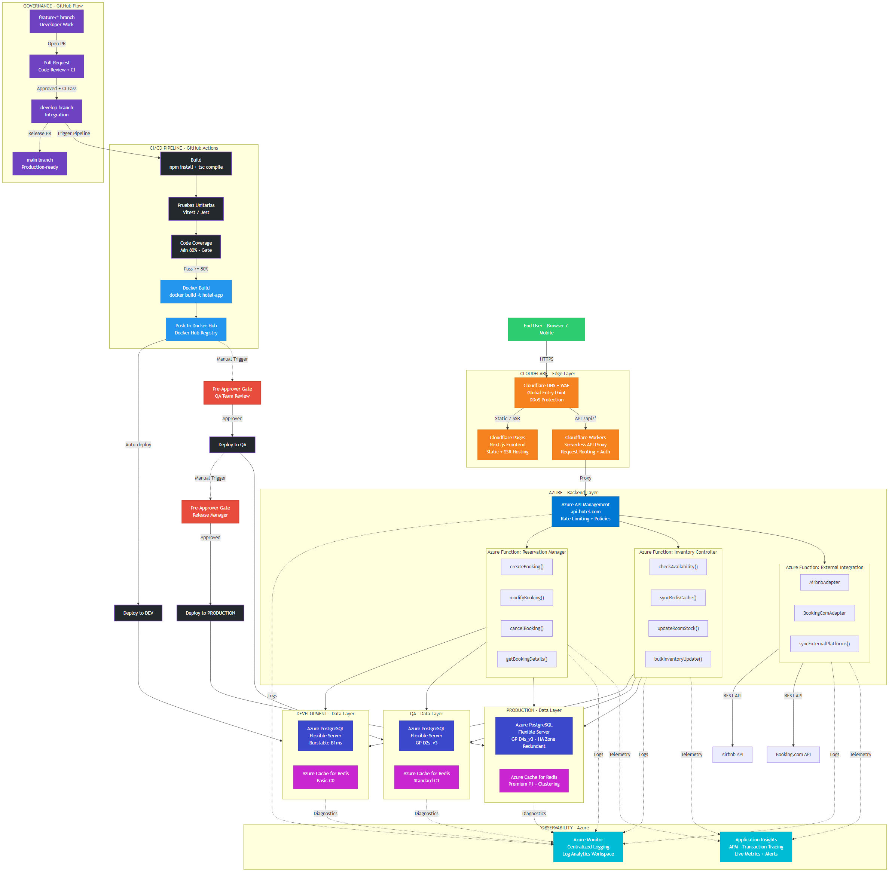

<div style="text-align: center; padding-top: 200px;">

# AzureEdge: High-Concurrency Hotel Reservation System

## Propuesta de Proyecto Final

---

**Materia:** DevOps

**Fecha:** Marzo 2026

---

</div>

<div style="page-break-after: always;"></div>

## Tabla de Contenidos

1. [Titulo y Descripcion del Proyecto](#1-titulo-y-descripcion-del-proyecto)
2. [Stack Tecnologico](#2-stack-tecnologico)
3. [Componentes del Sistema y Metodos](#3-componentes-del-sistema-y-metodos)
4. [Infraestructura y Despliegue](#4-infraestructura-y-despliegue)
5. [Pipeline DevOps y Gobernanza](#5-pipeline-devops-y-gobernanza)
6. [Plan de Observabilidad](#6-plan-de-observabilidad)
7. [Plan del Proyecto](#7-plan-del-proyecto)

<div style="page-break-after: always;"></div>

## 1. Titulo y Descripcion del Proyecto

**Nombre del Proyecto:** AzureEdge — High-Concurrency Hotel Reservation System

Aplicacion web profesional para la gestion de reservaciones hoteleras, disenada para soportar mas de 5,000 hoteles con alta concurrencia y consistencia de datos. El sistema utiliza un stack moderno de Next.js con TypeScript, desplegado sobre una arquitectura hibrida Azure + Cloudflare.

La capa edge de Cloudflare proporciona DNS global, proteccion WAF/DDoS, hosting del frontend via Cloudflare Pages, y un proxy serverless mediante Cloudflare Workers. El backend en Azure maneja la logica de negocio a traves de Azure Functions, con Azure API Management como punto de entrada, Azure Database for PostgreSQL como base de datos principal, y Azure Cache for Redis para cache de disponibilidad en tiempo real.

El pipeline CI/CD esta implementado con GitHub Actions, incluyendo pruebas unitarias, cobertura de codigo, dockerizacion, y un flujo de despliegue con gates de aprobacion manual hacia tres ambientes aislados (Development, QA, Production). La infraestructura se aprovisiona mediante Terraform/Kiro.

<div style="page-break-after: always;"></div>

## 2. Stack Tecnologico

### 2.1 Frontend y Edge (Cloudflare)

| Componente | Tecnologia |
|---|---|
| Framework | Next.js (React) con TypeScript |
| Hosting Frontend | Cloudflare Pages (SSR + Static) |
| DNS y Seguridad | Cloudflare DNS + WAF (DDoS Protection) |
| API Gateway Edge | Cloudflare Workers (Proxy Serverless) |

### 2.2 Backend (Azure)

| Componente | Tecnologia |
|---|---|
| API Management | Azure API Management |
| Compute | Azure Functions (Node.js 20.x) |
| Base de Datos | Azure Database for PostgreSQL — Flexible Server |
| Cache | Azure Cache for Redis |
| Observabilidad | Azure Monitor + Application Insights |

### 2.3 DevOps y Herramientas

| Componente | Tecnologia |
|---|---|
| CI/CD | GitHub Actions |
| Contenedores | Docker — Docker Hub Registry |
| IaC | Terraform / Kiro |
| Control de Versiones | Git (GitHub) |
| Pruebas Unitarias | Vitest / Jest |
| Cobertura de Codigo | Minimo 80% requerido |

<div style="page-break-after: always;"></div>

## 3. Componentes del Sistema y Metodos

### 3.1 Reservation Manager — Gestion de Reservaciones

Maneja el ciclo de vida completo de una reservacion hotelera.

| Metodo | Descripcion |
|---|---|
| `createBooking()` | Crea una nueva reservacion validando disponibilidad en Redis |
| `modifyBooking()` | Modifica fechas, habitacion o datos del huesped |
| `cancelBooking()` | Cancela una reservacion y libera inventario |
| `getBookingDetails()` | Consulta el detalle de una reservacion existente |

### 3.2 Inventory Controller — Control de Inventario

Gestiona la disponibilidad de habitaciones en tiempo real con sincronizacion Redis.

| Metodo | Descripcion |
|---|---|
| `checkAvailability()` | Consulta disponibilidad (Redis cache-first, fallback a PostgreSQL) |
| `syncRedisCache()` | Sincroniza el estado de inventario entre PostgreSQL y Redis |
| `updateRoomStock()` | Actualiza el stock de habitaciones tras una reservacion |
| `bulkInventoryUpdate()` | Actualizacion masiva de inventario para operaciones batch |

### 3.3 External Integration Service — Integraciones Externas

Capa de adaptadores modulares para conectar con plataformas de terceros.

| Metodo / Clase | Descripcion |
|---|---|
| `AirbnbAdapter` | Adaptador para sincronizacion con la API de Airbnb |
| `BookingComAdapter` | Adaptador para sincronizacion con la API de Booking.com |
| `syncExternalPlatforms()` | Orquesta la sincronizacion bidireccional de disponibilidad |

### 3.4 UI Components — Componentes de Interfaz (React)

| Componente | Descripcion |
|---|---|
| `SearchForm` | Formulario de busqueda de hoteles y fechas |
| `BookingFunnel` | Flujo paso a paso de reservacion |
| `ConfirmationView` | Vista de confirmacion post-reservacion |
| `HotelDashboard` | Panel de administracion para hoteleros |

<div style="page-break-after: always;"></div>

## 4. Infraestructura y Despliegue

### 4.1 Diagrama de Arquitectura



### 4.2 Flujo de Trafico

```
Usuario → Cloudflare DNS → Cloudflare WAF → Cloudflare Pages (Frontend)
                                           → Cloudflare Workers (API Proxy)
                                              → Azure API Management
                                                 → Azure Functions
                                                    → PostgreSQL / Redis
```

### 4.3 Estrategia de Ambientes y Tiers de Hardware

El sistema se despliega en tres ambientes aislados, cada uno con recursos Azure dimensionados segun su proposito:

| Ambiente | Base de Datos | Cache | Proposito |
|---|---|---|---|
| **Development** | Azure PostgreSQL — Burstable B1ms | Azure Redis — Basic C0 | Desarrollo y pruebas rapidas |
| **QA** | Azure PostgreSQL — GP D2s_v3 | Azure Redis — Standard C1 | Pruebas de aceptacion (UAT) |
| **Production** | Azure PostgreSQL — GP D4s_v3 (HA Zone Redundant) | Azure Redis — Premium P1 (Clustering) | Trafico real, alta disponibilidad |

### 4.4 Gates de Aprobacion Manual (Pre-Approvers)

El flujo de promocion entre ambientes requiere aprobacion explicita:

| Transicion | Gate | Aprobador |
|---|---|---|
| Docker Hub → Development | Automatico | Ninguno (auto-deploy al merge en `develop`) |
| Development → QA | Manual | Pre-Approver: QA Team Review |
| QA → Production | Manual | Pre-Approver: Release Manager Sign-off |

<div style="page-break-after: always;"></div>

## 5. Pipeline DevOps y Gobernanza

### 5.1 Pipeline CI/CD — GitHub Actions

Cada push a la rama `develop` dispara el siguiente flujo automatizado:

| Paso | Descripcion | Criterio de Exito |
|---|---|---|
| 1. Build | `npm install` + `tsc compile` | Compilacion sin errores |
| 2. Pruebas Unitarias | Ejecucion de suites Vitest / Jest | Todas las pruebas pasan |
| 3. Code Coverage | Analisis de cobertura de codigo | Minimo 80% requerido |
| 4. Docker Build | `docker build -t hotel-app` | Imagen construida exitosamente |
| 5. Push to Docker Hub | Push de la imagen al Docker Hub Registry | Imagen disponible en registry |
| 6. Deploy to Dev | Despliegue automatico al ambiente Development | Servicio operativo |
| 7. Gate QA | Aprobacion manual del equipo QA | Pre-Approver aprueba |
| 8. Deploy to QA | Despliegue al ambiente QA | UAT exitoso |
| 9. Gate Production | Aprobacion manual del Release Manager | Pre-Approver aprueba |
| 10. Deploy to Prod | Despliegue al ambiente Production | Sistema en produccion |

### 5.2 Estrategia de Branching — GitHub Flow

```
feature/* → Pull Request (Code Review + CI) → develop → Release PR → main
```

| Rama | Proposito | Reglas |
|---|---|---|
| `main` | Codigo listo para produccion | Solo merges desde `develop` via Release PR |
| `develop` | Rama de integracion | Recibe merges de feature branches |
| `feature/*` | Features individuales o bug fixes | Requiere PR + code review + CI passing |

Todas las fusiones requieren:
- Pull Request aprobado
- Al menos un code review
- Pipeline CI en estado passing

### 5.3 Infraestructura como Codigo (IaC)

Los recursos de Azure se aprovisionan mediante Terraform con archivos de variables por ambiente:

```bash
# Planificar cambios para un ambiente especifico
terraform plan -var-file=environments/dev.tfvars

# Aplicar cambios
terraform apply -var-file=environments/dev.tfvars
```

<div style="page-break-after: always;"></div>

## 6. Plan de Observabilidad

### 6.1 Herramientas de Monitoreo

| Herramienta | Funcion | Alcance |
|---|---|---|
| Azure Monitor | Logging centralizado — Log Analytics Workspace | Todos los ambientes (Dev, QA, Prod) |
| Application Insights | APM — Transaction tracing, live metrics, alertas | Todos los ambientes |
| Cloudflare Analytics | Metricas de edge — requests, bandwidth, WAF events | Capa edge global |

### 6.2 Estrategia de Observabilidad

- **Logs:** Todas las Azure Functions y Azure API Management envian logs a Azure Monitor con Log Analytics Workspace separados por ambiente.
- **Telemetria APM:** Application Insights recopila trazas de transacciones, metricas en tiempo real, y genera alertas automaticas ante degradacion de rendimiento.
- **Diagnosticos de Datos:** Los servicios de PostgreSQL y Redis envian diagnosticos a Azure Monitor para monitoreo de rendimiento de base de datos y cache.
- **Edge Analytics:** Cloudflare proporciona metricas de trafico global, eventos WAF, y analisis de rendimiento CDN.

<div style="page-break-after: always;"></div>

## 7. Plan del Proyecto

### 7.1 Tablero GitHub Projects (Kanban/Scrum)

| Columna | Contenido |
|---|---|
| Backlog | Integraciones futuras (Airbnb/Booking.com), mejoras no criticas |
| Todo | Tareas del sprint actual |
| In Progress | Desarrollo activo |
| Done | Verificado y desplegado |

### 7.2 Hitos Clave

| Fecha | Hito | Entregables |
|---|---|---|
| Marzo 15 | Entrega de Propuesta | Stack tecnologico, componentes, diagrama de arquitectura, plan de proyecto |
| Abril 10 | Infraestructura y Pipeline | Aprovisionamiento Azure via Terraform, pipeline CI/CD funcional, ambientes Dev/QA/Prod |
| Mayo 7-14 | Presentacion Final | Sistema funcional, demo en vivo, documentacion completa, metricas de cobertura |

### 7.3 Issues de GitHub Planificados

| # | Issue | Prioridad | Sprint |
|---|---|---|---|
| 1 | Configurar repositorio y estructura de proyecto | Alta | 1 |
| 2 | Aprovisionamiento de infraestructura Azure con Terraform | Alta | 1 |
| 3 | Configurar Cloudflare DNS, WAF y Pages | Alta | 1 |
| 4 | Implementar pipeline CI/CD con GitHub Actions | Alta | 1 |
| 5 | Desarrollar Reservation Manager (CRUD) | Alta | 2 |
| 6 | Desarrollar Inventory Controller con Redis cache | Alta | 2 |
| 7 | Implementar Cloudflare Workers como API proxy | Media | 2 |
| 8 | Configurar Azure Monitor y Application Insights | Media | 2 |
| 9 | Desarrollar External Integration Service (adaptadores) | Media | 3 |
| 10 | Implementar UI Components (SearchForm, BookingFunnel) | Media | 3 |
| 11 | Configurar gates de aprobacion manual (QA/Prod) | Media | 3 |
| 12 | Pruebas de integracion y cobertura >= 80% | Alta | 3 |
| 13 | Documentacion final y preparacion de demo | Alta | 4 |

---

*Documento generado como parte de la Propuesta de Proyecto Final — ReservFlow*
